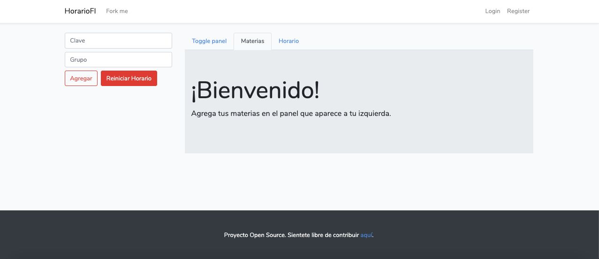

# Horario FI

***proyecto en fase de desarrollo***

```shell
julio, 2019
HTML 5 | js | css3 | bootstrap v4.1 | laravel 5.8 | php7.3 | laravel/installer2.1
```
Está página web fue creada con la finalidad de crear un horario lo más rápido posible ya que las vacantes para los grupos siempre se suelen acabar lo que hace que se tenga que reacomodar algunas de nuestras materias.




## Reglas de negocio

Hacer script para que cada 10 minutos se actualice el cupo disponible de los grupos.

### Si el usuario NO esta logueado

Se muestra dos input, el primero puede insertar la clave de la materia y en el segundo  el grupo, en caso de que 

### Si el usuario esta loguedo

Los datos básicos que se recaudarán del usuario son 

* Nombre
* Carrera
* Plan de estudios
* Año de ingreso a la facultad

Por semestre se pedirá que se actualicen los siguiente datos con la finalidad de que el proceso de generación de horario sea lo más rápido posible

* Clave de las materias que probablemente cursará en el semestre, indicar que se recomienda lista  de 7 a 9 materias con la finalidad de tener una amplia gamma de horarios a elegir.

Una vez que se eligieron las materias probablemente cursará se deben mostrar en un dropdown y en un segundo dropdown se deben mostrar los grupos de la asignatura que este seleccionada en el dropdown de asignaturas.

### API

Desarrollar las 

## Features / Issues

Corregir bug de despliegue del horario gráfico.

## Uso para desarrolladores

### Dependencias

El sitio web, al estar escrito en *laravel* y por ende se requiere tener instalado 

* npm 

  ```shell
  sudo pacman -S npm
  ```

* composer

  ```shell
  sudo pacman -S npm
  ```

* laravel

  ```shell
  composer global require laravel/installer
  ```

  Y se debe configurar el `$PATH`, para mi caso yo uso `fish shell` por lo cual

  ```shell
  vim ~/.config/fish/config.fish 
  ```

  ```shell
  set -gx $PATH $HOME/.config/composer/vendor/bin
  ```

* Y el manejador de DB que vaya a utlizar, se recomienda `sqlite`
  
  * Si utliza `sqlite`, debe tener instalado  `php-sqlite` y buscar la forma de habilitarlo en su sistema operativo (Se hace distinto en cada OS).
  
    Para el caso de linux, después de instalar `php-sqlite,` debe abrir en modo escritura el archivo
  
    `/etc/php/php.ini` y descomentar `;extension=pdo_sqlite.so`
  
    En **resumen**
  
    ```shell
    sudo pacman -S php-slite
    sudo vim /etc/php/php.ini
    ```

## Instalación


```shell
composer install
```

```shell
npm install
```

```shell
npm run dev
```

#### Configuración de la base de datos

Ahora debe configurar la conexión a la base de datos que vaya a usar (sqlite,MySQL,POSTGRESS,etc.), para realizar dicha configuración debe de modificar el archivo `.env`, si no tiene el archivo .env en el proyecto puede utilizar el `.env.example` como ejemplo, dicho archivo ya viene con las configuraciones para enlazarse con `sqlite`, por lo cual lo único que tiene que hacer es

```shell
cp .env.example .env
touch database/database.sqlite # El archivo creado es necesario para sqlite

php artisan key:generate
```

#### Hacer la migraciones y poblar la base de datos

```shell
php artisan migrate # Creando las tablas en la base de datos
```

```php
php artisan db:seed # Poblando la base de datos ... este comando tardará algo de tiempo
```

#### Lanzar el servidor

```shell
php artisan serve
php artisan serve --host 0.0.0.0 # Para poder ver la página el dispositivos móvles externos
```

##  Contribuciones

La guía para contribuir al proyecto se encuentre [aquí](CONTRIBUTING.md)

## Licencia

Este proyecto esta licenciado bajo Apache v2.0, para más información le la licencia entra [aquí](LICENSE)

## Futuras implementaciones

* Agregar un módulo para que los usuarios puedan agregar sus materias con sus repectivas claves y respectivos datos.

* Agregar un módulo dónde el usuario pueda agregar en formato JSON los datos de sus materias.

* Agregar un módulo para que en el mismo sistema se pueda buscar a los profesores y breves opiniones acerca de èl.